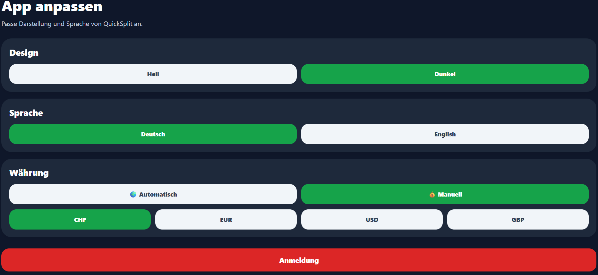
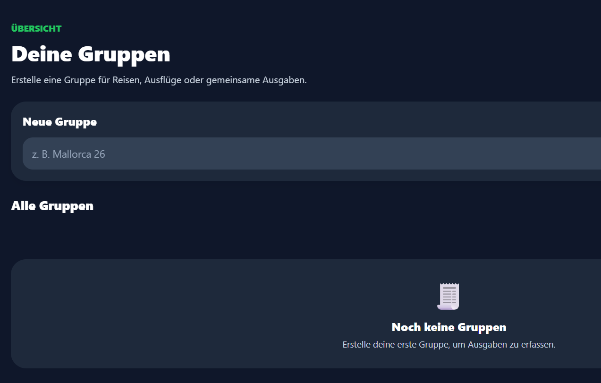
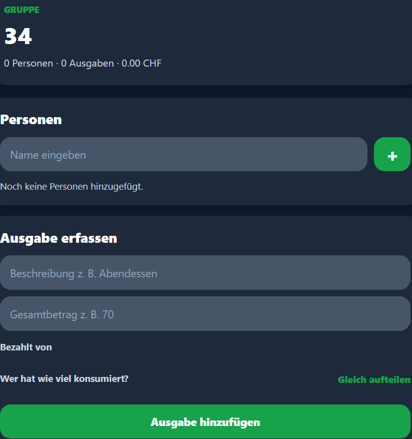
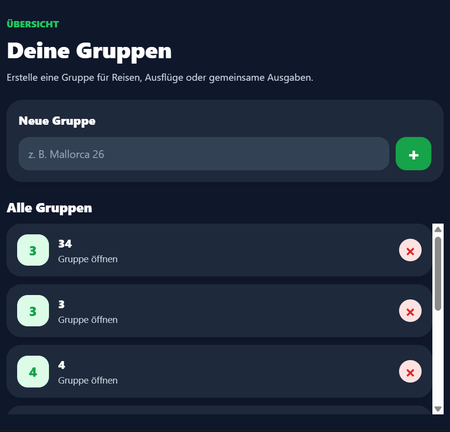
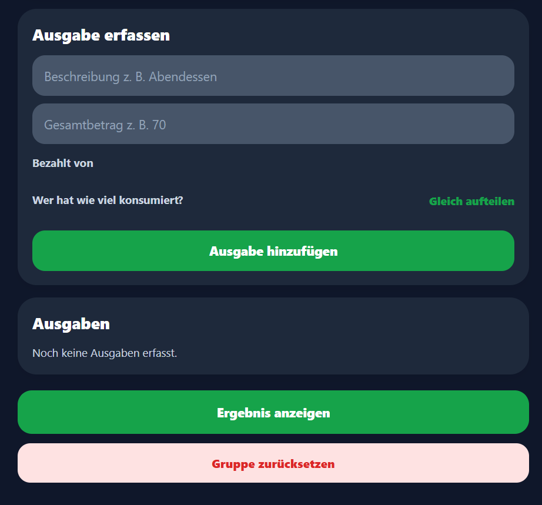
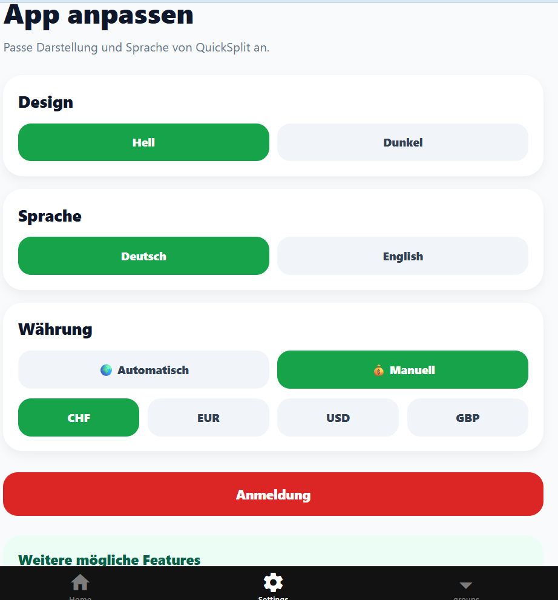

# QuickSplit – Testprotokoll (M335 LB3)

Dieses Testprotokoll dokumentiert funktionale und nicht-funktionale Tests für die App QuickSplit. Die App ermöglicht das Erstellen von Gruppen, das Erfassen von Ausgaben und die automatische Berechnung von Ausgleichszahlungen.

Grundlage des Testprotokolls sind das App-Konzept und die implementierten Funktionen wie Login, Gruppenverwaltung, Personenerfassung, Ausgabenerfassung, Ergebnisberechnung, Einstellungen sowie Datenspeicherung.

---

## Allgemeine Angaben

| Feld                       | Wert                                                |
| -------------------------- | --------------------------------------------------- |
| Projektname                | QuickSplit                                          |
| Modul                      | M335 – Mobile Applikationen realisieren             |
| Leistungsbeurteilung       | LB3                                                 |
| Version der App            | 1.0                                                 |
| Version des Testprotokolls | 1.0                                                 |
| Testdatum                  | 11.05.2026                                          |
| Tester                     | Emilija Antic                                       |
| Gesamtstatus               | ☐ Bestanden ☐ Teilweise bestanden ☐ Nicht bestanden |

---

## 1. Testumgebung

| Komponente           | Beschreibung                           |
| -------------------- | -------------------------------------- |
| Framework            | React Native mit Expo                  |
| Entwicklungsumgebung | Visual Studio Code                     |
| Speicherung          | AsyncStorage                           |
| Authentifizierung    | Firebase Authentication                |
| Testgeräte           | Android Smartphone, iPhone, Webbrowser |
| Build                | Expo Go                                |

---

## 2. Legende

| Begriff   | Bedeutung                                              |
| --------- | ------------------------------------------------------ |
| Status    | Bestanden / Nicht bestanden / Teilweise Bestanden      |
| Priorität | Hoch / Mittel / Niedrig                                |
| Testart   | Funktional, UX, Sicherheit, Persistenz, Kompatibilität |

---

## 3. Testfälle

| ID     | Bereich        | Testfall                                       | Schritte                                                   | Erwartetes Ergebnis                                                          | Priorität | Status              | Bemerkungen                                                         | Screenshot                                                                                              |
| ------ | -------------- | ---------------------------------------------- | ---------------------------------------------------------- | ---------------------------------------------------------------------------- | --------- | ------------------- | ------------------------------------------------------------------- | ------------------------------------------------------------------------------------------------------- |
| TC-001 | Login          | Login mit gültigen Benutzerdaten               | E-Mail und Passwort eingeben                               | Benutzer wird erfolgreich angemeldet und zu Gruppen weitergeleitet           | Hoch      | Bestanden           |                                                                     |                                                                                                         |
| TC-002 | Login          | Login mit falschem Passwort                    | Falsches Passwort eingeben                                 | Fehlermeldung wird angezeigt                                                 | Hoch      | Teilweise Bestanden | Login fehlgeschlagen, Fehlermeldung erscheint nicht                 |                                                                                                         |
| TC-003 | Login          | Login mit ungültiger E-Mail                    | Ungültige E-Mail eingeben                                  | Validierungsfehler                                                           | Hoch      | Teilweise Bestanden | Login fehlgeschlagen, Fehlermeldung erscheint nicht                 |                                                                                                         |
| TC-004 | Registrierung  | Registrierung mit gültigen Daten               | Vorname, Nachname, Username, E-Mail, Passwort eingeben     | Konto wird erstellt                                                          | Hoch      | Bestanden           |                                                                     |                                                                                                         |
| TC-005 | Registrierung  | Registrierung mit bereits verwendeter E-Mail   | Bestehende E-Mail verwenden                                | Fehlermeldung                                                                | Hoch      | Teilweise Bestanden | Registrierung fehlgeschlagen, Fehlermeldung erscheint nicht         |                                                                                                         |
| TC-006 | Registrierung  | Passwort unter 6 Zeichen                       | Kurzes Passwort eingeben                                   | Fehlermeldung                                                                | Hoch      | Teilweise Bestanden | Registrierung fehlgeschlagen, Fehlermeldung erscheint nicht         |                                                                                                         |
| TC-007 | Gastmodus      | Weiter ohne Login                              | Button „Als Gast fortfahren“ drücken                       | App öffnet Gruppenübersicht                                                  | Mittel    | Bestanden           |                                                                     |                                                                                                         |
| TC-008 | Logout         | Ausloggen                                      | Logout-Button drücken                                      | Benutzer wird abgemeldet und zum Login weitergeleitet                        | Hoch      | Bestanden           |                                                                     |                                                                                                         |
| TC-009 | Gruppen        | Neue Gruppe erstellen                          | Gruppenname eingeben und + drücken                         | Gruppe wird gespeichert                                                      | Hoch      | Bestanden           |                                                                     |                                                                                                         |
| TC-010 | Gruppen        | Leerer Gruppenname                             | Keinen Namen eingeben                                      | Fehlermeldung                                                                | Hoch      | Teilweise Bestanden | Passiert nichts, keine Fehlermeldung                                |                                                                                                         |
| TC-011 | Gruppen        | Mehrere Gruppen erstellen                      | 3 Gruppen anlegen                                          | Alle Gruppen werden angezeigt                                                | Mittel    | Bestanden           |                                                                     |                                                                                                         |
| TC-012 | Gruppen        | Gruppe öffnen                                  | Auf Gruppeneintrag tippen                                  | Gruppen-Screen wird geöffnet                                                 | Hoch      | Bestanden           |                                                                     |                                                                                                         |
| TC-013 | Gruppen        | Gruppe löschen                                 | Löschbutton drücken                                        | Gruppe wird entfernt                                                         | Hoch      | Bestanden           |                                                                     |                                                                                                         |
| TC-014 | Persistenz     | Gruppen nach App-Neustart vorhanden            | App schließen und erneut öffnen                            | Gruppen bleiben gespeichert                                                  | Hoch      | Bestanden           |                                                                     |                                                                                                         |
| TC-015 | Personen       | Person hinzufügen                              | Namen eingeben                                             | Person erscheint in Liste                                                    | Hoch      | Bestanden           |                                                                     |                                                                                                         |
| TC-016 | Personen       | Leerer Personenname                            | Keinen Namen eingeben                                      | Fehlermeldung                                                                | Hoch      | Teilweise Bestanden | Passiert nichts, Fehlermeldung erscheint nicht                      |                                                                                                         |
| TC-017 | Personen       | Doppelte Person                                | Gleichen Namen erneut eingeben                             | Fehlermeldung                                                                | Hoch      | Teilweise Bestanden | Name wird nicht nochmals hinzugefügt, Fehlermeldung erscheint nicht |                                                                                                         |
| TC-018 | Personen       | Person löschen                                 | Person lange drücken                                       | Person wird entfernt                                                         | Mittel    | Bestanden           |                                                                     |                                                                                                         |
| TC-019 | Persistenz     | Personen nach Neustart vorhanden               | App neu starten                                            | Personen bleiben gespeichert                                                 | Hoch      | Bestanden           |                                                                     |                                                                                                         |
| TC-020 | Ausgaben       | Ausgabe hinzufügen                             | Beschreibung, Betrag, Zahler, Anteile eingeben             | Ausgabe wird gespeichert                                                     | Hoch      | Bestanden           |                                                                     |                                                                                                         |
| TC-021 | Ausgaben       | Weniger als 2 Personen                         | Ausgabe hinzufügen                                         | Fehlermeldung                                                                | Hoch      | Teilweise Bestanden | Ausgabe wird nicht erstellt, Fehlermeldung erscheint nicht          |                                                                                                         |
| TC-022 | Ausgaben       | Leere Beschreibung                             | Beschreibung leer lassen                                   | Fehlermeldung                                                                | Hoch      | Teilweise Bestanden | Passiert nichts, Fehlermeldung erscheint nicht                      |                                                                                                         |
| TC-023 | Ausgaben       | Betrag = 0                                     | 0 eingeben                                                 | Fehlermeldung                                                                | Hoch      | Teilweise Bestanden | Passiert nichts, Fehlermeldung erscheint nicht                      |                                                                                                         |
| TC-024 | Ausgaben       | Negativer Betrag                               | -10 eingeben                                               | Fehlermeldung                                                                | Hoch      | Teilweise Bestanden | Passiert nichts, Fehlermeldung erscheint nicht                      |                                                                                                         |
| TC-025 | Ausgaben       | Kein Zahler ausgewählt                         | Zahler leer                                                | Fehlermeldung                                                                | Hoch      | Teilweise Bestanden | Es muss ein Zahler ausgewählt sein                                  |                                                                                                         |
| TC-026 | Ausgaben       | Anteile stimmen nicht mit Gesamtbetrag überein | Falsche Summen eingeben                                    | Fehlermeldung                                                                | Hoch      | Teilweise Bestanden | Passiert nichts, Fehlermeldung erscheint nicht                      |                                                                                                         |
| TC-027 | Ausgaben       | Gleich aufteilen                               | Button „Gleich aufteilen“ drücken                          | Betrag wird gleichmässig verteilt                                            | Hoch      | Bestanden           |                                                                     |                                                                                                         |
| TC-028 | Ausgaben       | Kommazahlen mit Komma                          | 12,50 eingeben                                             | Wird korrekt verarbeitet                                                     | Mittel    | Bestanden           |                                                                     |                                                                                                         |
| TC-029 | Ausgaben       | Ausgabe löschen                                | Löschbutton drücken                                        | Ausgabe wird entfernt                                                        | Mittel    | Bestanden           |                                                                     |                                                                                                         |
| TC-030 | Persistenz     | Ausgaben nach Neustart vorhanden               | App neu starten                                            | Ausgaben bleiben gespeichert                                                 | Hoch      | Bestanden           |                                                                     |                                                                                                         |
| TC-031 | Ergebnis       | Ergebnis anzeigen                              | Button „Ergebnis anzeigen“ drücken                         | Resultat-Screen wird geöffnet                                                | Hoch      | Bestanden           |                                                                     |                                                                                                         |
| TC-032 | Ergebnis       | Keine Ausgaben vorhanden                       | Ergebnis öffnen                                            | Fehlermeldung                                                                | Hoch      | Teilweise Bestanden | Passiert nichts, Fehlermeldung erscheint nicht                      |                                                                                                         |
| TC-033 | Ergebnis       | Korrekte Summenberechnung                      | Beispieldaten eingeben                                     | Gesamtsumme ist korrekt                                                      | Hoch      | Bestanden           |                                                                     |                                                                                                         |
| TC-034 | Ergebnis       | Korrekte Salden                                | Beispieldaten eingeben                                     | Bezahlt/Konsumiert stimmen                                                   | Hoch      | Bestanden           |                                                                     |                                                                                                         |
| TC-035 | Ergebnis       | Korrekte Ausgleichszahlungen                   | Beispieldaten eingeben                                     | Wer schuldet wem wird korrekt berechnet                                      | Hoch      | Bestanden           |                                                                     |                                                                                                         |
| TC-036 | Einstellungen  | Theme auf Dunkel stellen                       | Dunkel auswählen                                           | Dark Mode wird aktiviert                                                     | Mittel    | Bestanden           |                                                                     |                                                                                                         |
| TC-037 | Einstellungen  | Theme auf Hell stellen                         | Hell auswählen                                             | Light Mode wird aktiviert                                                    | Mittel    | Bestanden           |                                                                     |                                                                                                         |
| TC-038 | Einstellungen  | Sprache auf Englisch                           | English auswählen                                          | Texte erscheinen auf Englisch                                                | Mittel    | Bestanden           |                                                                     |                                                                                                         |
| TC-040 | Einstellungen  | Sprache auf Deutsch                            | Deutsch auswählen                                          | Texte erscheinen auf Deutsch                                                 | Mittel    | Bestanden           |                                                                     |                                                                                                         |
| TC-041 | Persistenz     | Einstellungen bleiben gespeichert              | App neu starten                                            | Theme und Sprache bleiben erhalten                                           | Mittel    | Bestanden           |                                                                     |                                                                                                         |
| TC-042 | Sicherheit     | Passwort wird verdeckt angezeigt               | Passwort eingeben                                          | Zeichen sind nicht sichtbar                                                  | Hoch      | Bestanden           |                                                                     |                                                                                                         |
| TC-043 | Sicherheit     | Unautorisierter Zugriff nach Logout            | Nach Logout zurück navigieren                              | Kein Zugriff auf geschützte Seiten                                           | Mittel    | Bestanden           |                                                                     |                                                                                                         |
| TC-044 | UX             | Buttons sind gut bedienbar                     | Auf Smartphone testen                                      | Buttons ≥ 48×48 dp                                                           | Mittel    | Bestanden           |                                                                     |                                                                        |
| TC-045 | UX             | Texte gut lesbar                               | Normale Betrachtung                                        | Keine Zoom-Funktion nötig                                                    | Mittel    | Bestanden           |                                                                     |                                                                           |
| TC-046 | UX             | Navigation intuitiv                            | App ohne Anleitung nutzen                                  | Funktionen sind leicht auffindbar                                            | Mittel    | Bestanden           |                                                                     |                                                                     |
| TC-047 | UX             | Fehlermeldungen verständlich                   | Ungültige Eingaben auslösen                                | Klare Meldungen werden angezeigt                                             | Mittel    | Nicht Bestanden     | Fehlermeldungen wurden aus zeitlichen Gründen nicht eingebaut       |                                                                                                         |
| TC-048 | Kompatibilität | Android-Test                                   | Auf Android starten                                        | App funktioniert fehlerfrei                                                  | Hoch      | Bestanden           |                                                                     |                                                                                                         |
| TC-049 | Kompatibilität | iOS-Test                                       | Auf iPhone starten                                         | App funktioniert fehlerfrei                                                  | Mittel    | Bestanden           |                                                                     |                                                                                                         |
| TC-050 | Kompatibilität | Web-Test                                       | Im Browser starten                                         | Grundfunktionen funktionieren                                                | Mittel    | Bestanden           |                                                                     |                                                                                                         |
| TC-051 | Kompatibilität | Hochformat                                     | Auf Smartphone testen                                      | Layout korrekt                                                               | Mittel    | Bestanden           |                                                                     |                                                                                                         |
| TC-052 | Kompatibilität | Tablet                                         | Auf Tablet testen                                          | Layout passt sich an                                                         | Niedrig   | Bestanden           |                                                                     |                                                                                                         |
| TC-053 | Robustheit     | Sehr lange Gruppennamen                        | 100 Zeichen eingeben                                       | App bleibt stabil                                                            | Niedrig   | Bestanden           |                                                                     |                                                                                                         |
| TC-054 | Robustheit     | Sehr lange Personennamen                       | 100 Zeichen eingeben                                       | App bleibt stabil                                                            | Niedrig   | Bestanden           |                                                                     |                                                                                                         |
| TC-055 | Robustheit     | Viele Gruppen                                  | 50 Gruppen erstellen                                       | Performance bleibt akzeptabel                                                | Niedrig   | Bestanden           |                                                                     |                                                                                                         |
| TC-056 | Robustheit     | Viele Ausgaben                                 | 100 Ausgaben erfassen                                      | Berechnung bleibt korrekt                                                    | Mittel    | Bestanden           |                                                                     |                                                                                                         |
| TC-057 | Robustheit     | App ohne Internet im Gastmodus                 | Offline starten                                            | Lokale Funktionen funktionieren                                              | Mittel    | Bestanden           |                                                                     |                                                                                                         |
| TC-058 | Robustheit     | Netzwerkfehler beim Login                      | Internet deaktivieren                                      | Passende Fehlermeldung                                                       | Mittel    | Teilweise Bestanden | Login fehlgeschlagen, Fehlermeldung erscheint nicht                 |                                                                                                         |
| TC-059 | UX             | Einheitliches Design                           | Alle Screens durchgehen                                    | Farben, Schriftgrössen und Abstände sind einheitlich                         | Mittel    | Bestanden           |                                                                     |    |
| TC-060 | UX             | Eingabefelder verständlich beschriftet         | Formularfelder prüfen                                      | Benutzer erkennt sofort, was eingegeben werden muss                          | Mittel    | Bestanden           |                                                                     |                                                                     |
| TC-061 | UX             | Zurück-Navigation funktioniert                 | Zwischen Screens wechseln und zurückgehen                  | Benutzer gelangt korrekt zum vorherigen Screen                               | Hoch      | Bestanden           |                                                                     |                                                                                                         |
| TC-062 | UX             | Keine abgeschnittenen Texte                    | App auf Smartphone testen                                  | Texte werden vollständig angezeigt                                           | Mittel    | Bestanden           |                                                                     |                                                                                                         |
| TC-063 | UX             | Scrollen funktioniert                          | Lange Listen mit Gruppen, Personen und Ausgaben testen     | Inhalte sind vollständig erreichbar                                          | Hoch      | Bestanden           |                                                                     |                                                                       |
| TC-064 | UX             | Wichtige Buttons klar erkennbar                | Hauptfunktionen prüfen                                     | Buttons wie Speichern, Löschen und Ergebnis anzeigen sind eindeutig sichtbar | Mittel    | Bestanden           |                                                                     |                                                                    |
| TC-065 | UX             | App reagiert nach Aktionen sichtbar            | Gruppe, Person oder Ausgabe hinzufügen                     | Änderung ist direkt sichtbar                                                 | Hoch      | Bestanden           |                                                                     |                                                                                                         |
| TC-066 | UX             | Bedienung im Dark Mode angenehm                | Dark Mode aktivieren und App testen                        | Texte und Buttons bleiben gut lesbar                                         | Mittel    | Bestanden           |                                                                     |                                                                      |
| TC-067 | UX             | Bedienung im Light Mode angenehm               | Light Mode aktivieren und App testen                       | Texte und Buttons bleiben gut lesbar                                         | Mittel    | Bestanden           |                                                                     |                                                                     |
| TC-068 | UX             | Verständliche leere Zustände                   | Gruppenliste, Personenliste oder Ausgabenliste leer öffnen | Benutzer erkennt, dass noch keine Daten vorhanden sind                       | Mittel    | Teilweise Bestanden | Teilweise passiert nichts, Hinweis fehlt                            |                                                                                                         |

## 4. Testdaten für Berechnungsbeispiel

**Personen:** Anna, Ben, Luca

**Ausgabe 1:** Abendessen, 90 CHF, bezahlt von Anna, je 30 CHF konsumiert

**Erwartung:**

- Ben schuldet Anna 30 CHF
- Luca schuldet Anna 30 CHF

---

## 5. Zusammenfassung

Insgesamt wurden 68 Testfälle definiert. Fehlermeldungen müssen noch implementiert werden. Das Protokoll deckt funktionale Anforderungen, Persistenz, Sicherheit, Benutzerfreundlichkeit, Kompatibilität und Robustheit ab.
